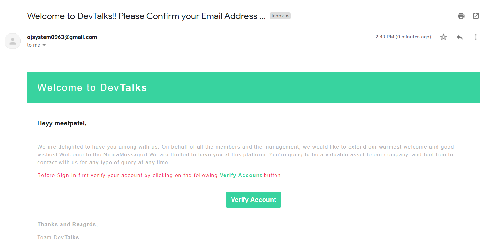
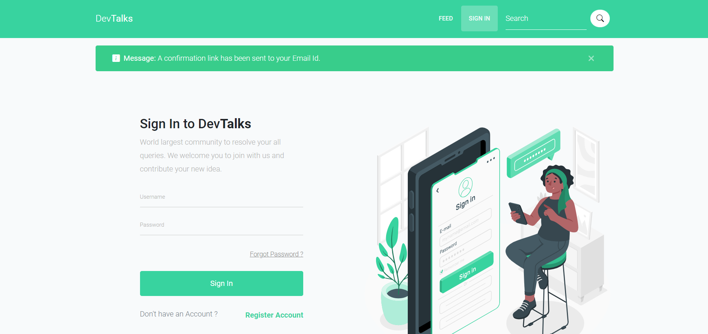
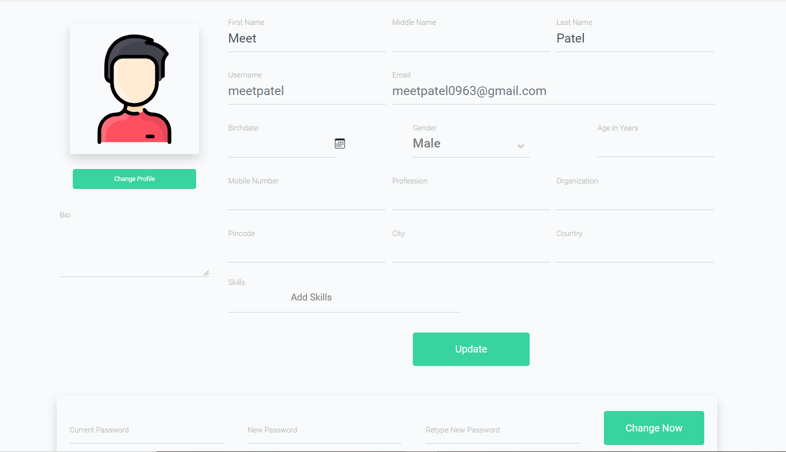
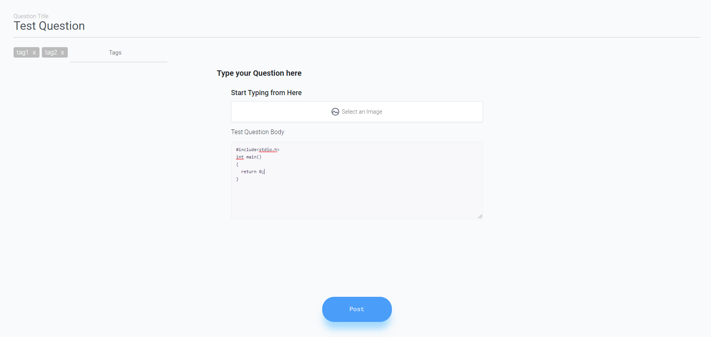
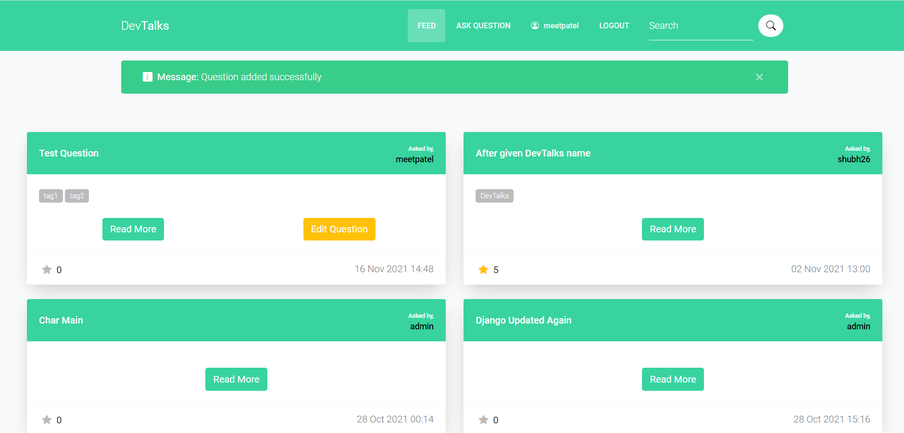
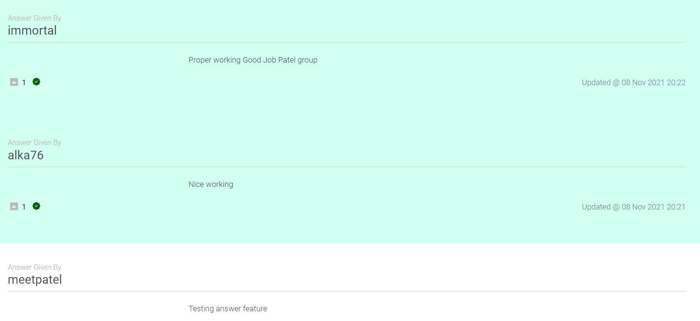
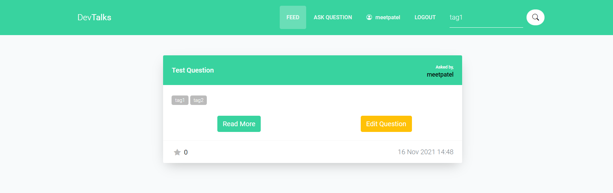
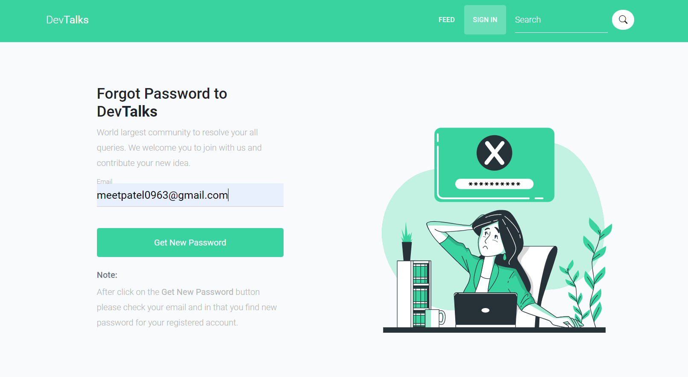
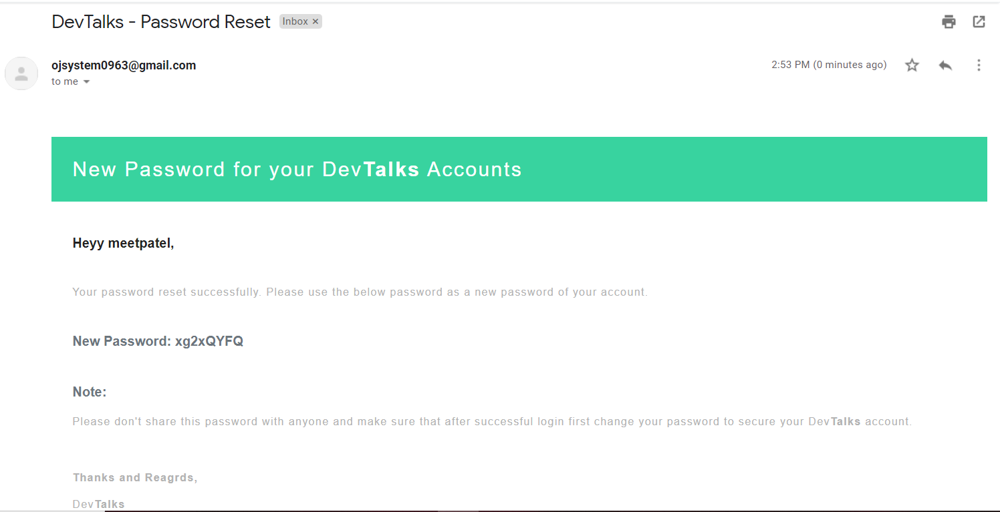

# DevTalks
- DevTalks is a Question-Answer website similar to stackoverflow for professional and enthusiast programmers.
- Students/developers can post their questions with appropriate tags and answer others’ questions. 
- This helps to build a community of experienced developers and students where everybody can learn from each other.

# UI Snapshots
### Registration

### Verification Email

### Sign In

### Profile 

### Ask Questions

### Questions Feed

### Add Answer 

### Tag Based Filtering

### Forgot Password

### Reset Password Email

## Thanks
+ I'd appreciate a star if you find this helpful.